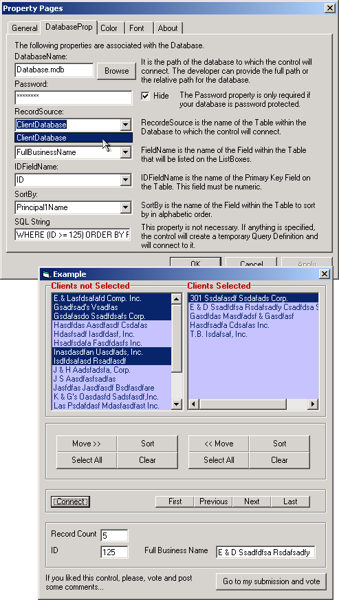



## a\(UPDATED \- July 23\) A Two List Boxes ActiveX Control \- It's original, useful and very instructive\!

### Description

Let's say, for example, that you have a database with all your clients. Now, you want to select just a few of them and get all the information stored on the database about them. The ideal interface to solve this problem would be to have a List Box with all your clients on one side and an empty List Box on the other side. You could, then, select the clients that you wanted just by double-clicking on their name. The selected clients would move to the empty List Box. When you finished with the selections, you would be able to access a Recordset with only the clients that you selected!

----

Sounds good? Well, this ActiveX Control does just that!

----

>> If you ever tried to create an interface using two List Boxes you will truly appreciate this Control. Here is a list of the main features:

----

* It will connect to a password protected Database.

----

* The users can navigate on the Control with their keyboard.

----

* It will list the records according to the specified field.

----

* The users can select multiple items.

----

* A Recordset will be generated with the selected clients!

----

>> I worked as hard on the user interface as I did on the programmer interface. The Property Pages are very useful!

----

* You will be able to browse to the folder were your Database is!

----

* As soon as you provide a database name, the Property Page will list all Tables on a Combo Box so you can easily select a Table!

----

* As soon as you select the Table, the Property Page will list all the Fields from this Table on Combo Boxes so you can easily pick one Field according to the situation!

----

>> What you can learn from this submission:

----

* How to connect to a Database, a Recordset, a Table or a Query Definition.

----

* How to create a temporary Query Definition.

----

* How to create a SQL statement.

----

* How to sort a Recordset.

----

* How to list all Tables found on a Database and all Fields found on a Table!

----

* How to find out if a Field is a Primary Key or if it is a numeric Field!

----

* How to sort an array on numeric order using the "bucket sort" algorithm.

----

* How to sort a "two dimensional" array on alphabetical order using the "Bubble" algorithm.

----

* How to find the width of a string in Twips or Pixels!

----

* How to add a horizontal Scroll Bar to a List Box and how to find out if a List Box needs a horizontal Scroll Bar!

----

* This ActiveX Control comes with a nice Common Dialog Box Module!

----

This ActiveX Control does a few tasks that, at first glance, look very simple. However, it took me almost a month to finish it. So, please, give me your vote and post some comments. There are literally dozens of reasons to download this ActiveX Control! Go ahead and do so!!
 
### More Info
 

             |
---                |---
**Submitted On**   |2002-07-23 13:19:50
**By**             |[Elias Barbosa](https://github.com/Planet-Source-Code/PSCIndex/blob/master/ByAuthor/elias-barbosa.md)
**Level**          |Intermediate
**User Rating**    |4.8 (223 globes from 46 users)
**Compatibility**  |VB 6\.0
**Category**       |[Custom Controls/ Forms/  Menus](https://github.com/Planet-Source-Code/PSCIndex/blob/master/ByCategory/custom-controls-forms-menus__1-4.md)
**World**          |[Visual Basic](https://github.com/Planet-Source-Code/PSCIndex/blob/master/ByWorld/visual-basic.md)
**Archive File**   |[a\(UPDATED\)1096417232002\.zip](https://github.com/Planet-Source-Code/elias-barbosa-a-updated-july-23-a-two-list-boxes-activex-control-it-s-original-useful-and-__1-36715/archive/master.zip)

